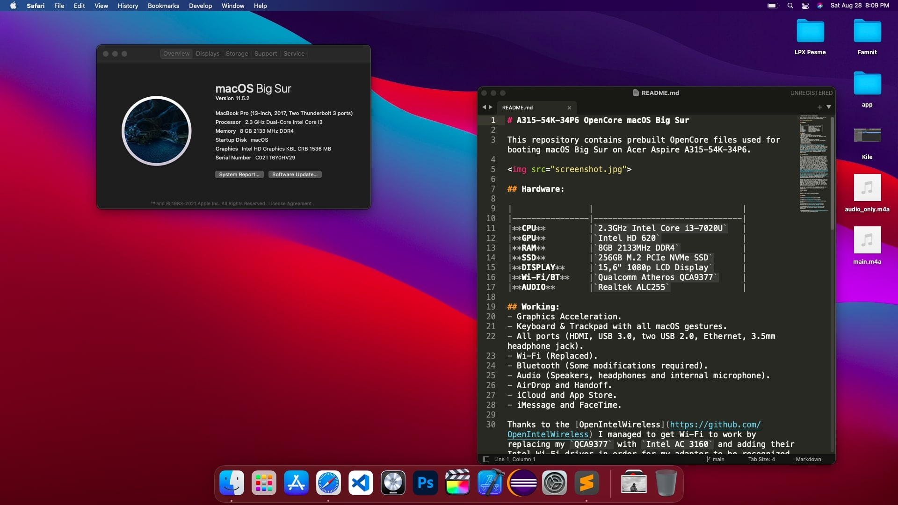
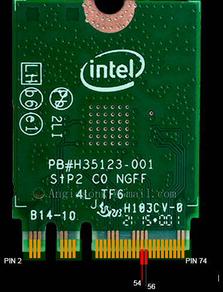

# A315-54K-34P6 OpenCore macOS Monterey

This repository contains prebuilt OpenCore files used for booting macOS Monterey on Acer Aspire 3 A315-54K-34P6.

## :warning: DISCLAIMER:

This is not a guide nor a plug and play EFI folder. This OpenCore configuration is optimized for my specific hardware. Use it only as a reference!

## :computer: HARDWARE:

|                |                          	 |
|----------------|-------------------------------|
|**CPU**		 |`2.3GHz Intel Core i3-7020U`	 |
|**GPU**		 |`Intel HD 620`				 |
|**RAM**         |`8GB 2133MHz DDR4`             |
|**SSD**         |`256GB M.2 PCIe NVMe SSD`		 |
|**Display**     |`15,6" 1080p LCD Display`		 |
|**Wi-Fi/BT**    |`Intel AC 3160`	  			 |
|**Ethernet**    |`Realtek RTL8111`				 |
|**Audio** 		 |`Realtek ALC255`				 |
|**Trackpad**    |`I2C Synaptics`				 |

## :white_check_mark: WORKING:

- Graphics Acceleration.
- Battery readout.
- Keyboard & Trackpad with all macOS gestures.
- Wi-Fi.
- USB ports.
- HDMI video and audio output.
- Audio (Internal speakers, 3.5mm headphone jack).
- Internal microphone.
- iCloud and App Store.
- iMessage and FaceTime.

## :x: NOT WORKING:

- Battery cycle count
- Bluetooth (Monterey)
- AirDrop and Handoff (Monterey)

I managed to get the Wi-Fi working by replacing my original `Qualcomm Atheros QCA9377` with `Intel AC 3160` and with now various Intel wireless adapters being supported in macOS (thanks to the [OpenIntelWireless](https://github.com/OpenIntelWireless)), I've been able to get mine up and running as well. If your Intel wireless adapter is not in the [supported list](https://openintelwireless.github.io/itlwm/Compat.html#dvm-iwn) or if you have a different wireless adapter, you should remove `AirportItlwm.kext` from the Kexts folder. 

## :warning: WARNING:

Bluetooth is broken in Monterey. The below applies to Big Sur and/or previous versions of macOS.

As for the Bluetooth, it was a bit more complicated. It's been months since I successfully booted into macOS with this configuration and it wasn't till recently that I found a solution for the Bluetooth not working issue that I had. I thought it was faulty hardware as I never got the Bluetooth to work in both macOS and Linux but to my surprise, it was something quite unexpected. Apparently, it seems like my Intel wireless adapter has some incompatible pins, or may I say a different arrangement from the original one (`QCA9377`). Long story short, I had to tape two pins on my `AC 3160` that are used to sense a Wi-Fi/Bluetooth "power off" signal. Blocking the two pins prevents the adapter from receiving a "power off" signal and keeps it on continuously.

Since the old adapter lacked these pins, taping the two in the new one seems to be a solution. If you are facing a similar issue or want to find out more, check out this amazing [**article**](https://thecomputerperson.wordpress.com/2016/11/04/how-to-mask-off-the-wifi-power-off-pins-on-m-2-ngff-wireless-cards-the-old-mini-pci-pin-20-trick/) that cleared it out to me.

If your Intel Bluetooth device is not in the [supported list](https://openintelwireless.github.io/IntelBluetoothFirmware/Compat.html) or if you have a different Bluetooth device, you should remove `IntelBluetoothFirmware.kext` and `IntelBluetoothInjector.kext` from the Kexts folder. 

I went with an Intel for the Wi-Fi and Bluetooth as it was a cheaper solution (I got it for like 5 bucks used) and to be honest, I have no complaints whatsoever. The Wi-Fi and Bluetooth are working perfectly, I would say even better than what I had with `QCA9377` in Linux. For now, I'm just happy that I have 1 more USB port and that I don't have to use a USB Wi-Fi adapter anymore.

If you want a working Wi-Fi and Bluetooth out of the box, I suggest you look for Apple-branded Broadcom wireless counterparts.

As you can see all this paragraph is mostly related to Wi-Fi and Bluetooth and that's because, other than Wi-Fi/BT (Which are now working), I really haven't had any issues running macOS with this configuration, it runs like a charm. Perhaps the only thing I could improve is the boot time. It's not that is slow (takes around 15 seconds from boot picker to login screen) but I think it has room for improvement since it's running on NVMe.
 
## CREDITS:

[**Acer**](http://acer.com/) for the laptop.

[**Apple**](http://apple.com/) for the macOS.

[**RehabMan**](https://github.com/RehabMan) for the great guides.

[**alexandred**](https://github.com/alexandred) for VoodooI2C kext and making it work with the trackpad.

[**Acidanthera**](https://github.com/acidanthera) for awesome kexts and first-class support for hackintosh enthusiasts.

[**OpenIntelWireless**](https://github.com/OpenIntelWireless) for Intel WI-FI and Bluetooth drivers.