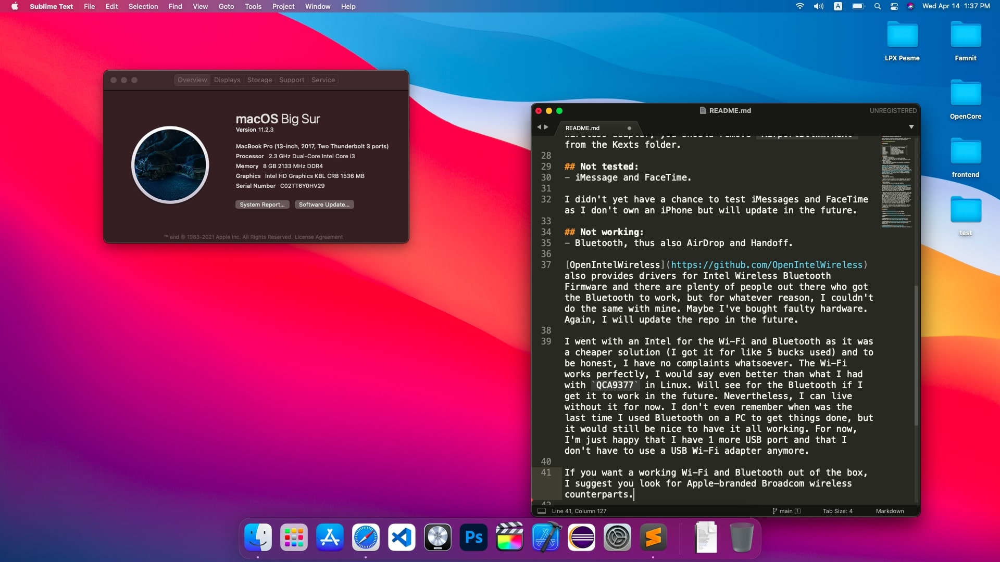

# A315-54K-34P6 OpenCore macOS Big Sur

This repository contains prebuilt OpenCore files used for booting macOS Big Sur on Acer Aspire A315-54K-34P6.

## Hardware:

|                |                          	 |
|----------------|-------------------------------|
|**CPU**		 |`2.3GHz Intel Core i3-7020U`	 |
|**GPU**		 |`Intel HD 620`				 |
|**RAM**         |`8GB 2133MHz DDR4`             |
|**SSD**         |`256GB M.2 PCIe NVMe SSD`		 |
|**DISPLAY**     |`15,6" 1080p LCD Display`		 |
|**Wi-Fi/BT**    |`Qualcomm Atheros QCA9377`	 |
|**AUDIO** 		 |`Realtek ALC255`				 |

## Working:
- Graphics Acceleration.
- Keyboard & Trackpad with all macOS gestures.
- All ports (HDMI, USB 3.0, two USB 2.0, Ethernet, 3.5mm headphone jack).
- Wi-Fi (Replaced).
- Audio (Speakers, headphones and internal microphone).
- iCloud and App Store.

Thanks to the [OpenIntelWireless](https://github.com/OpenIntelWireless) I managed to get Wi-Fi to work by replacing my `QCA9377` with `Intel AC 3160` and adding their Intel Wi-Fi driver in order for my adapter to be recognized in macOS. If your Intel wireless adapter is not in the [supported list](https://openintelwireless.github.io/itlwm/Compat.html#dvm-iwn) or if you have a different wireless adapter, you should remove `AirportItlwm.kext` from the Kexts folder. 

## Not tested:
- iMessage and FaceTime.

I didn't yet have a chance to test iMessages and FaceTime as I don't own an iPhone but will update in the future.

## Not working:
- Bluetooth, thus also AirDrop and Handoff.

[OpenIntelWireless](https://github.com/OpenIntelWireless) also provides drivers for Intel Wireless Bluetooth Firmware and there are plenty of people out there who got the Bluetooth to work, but for whatever reason, I couldn't do the same with mine. Maybe I've bought faulty hardware. Again, I will update the repo in the future.

I went with an Intel for the Wi-Fi and Bluetooth as it was a cheaper solution (I got it for like 5 bucks used) and to be honest, I have no complaints whatsoever. The Wi-Fi works perfectly, I would say even better than what I had with `QCA9377` in Linux. Will see for the Bluetooth if I get it to work in the future. Nevertheless, I can live without it for now. I don't even remember when was the last time I used Bluetooth on a PC to get things done, but it would still be nice to have it all working. For now, I'm just happy that I have 1 more USB port and that I don't have to use a USB Wi-Fi adapter anymore.

If you want a working Wi-Fi and Bluetooth out of the box, I suggest you look for Apple-branded Broadcom wireless counterparts.

 
## Credits:

[**Acer**](http://acer.com/) for the laptop.

[**Apple**](http://apple.com/) for the macOS.

[**RehabMan**](https://github.com/RehabMan) for the great guides.

[**alex.daoud**](https://github.com/alexandred) for VoodooI2C kext and making it work with the trackpad.

[**acidanthera**](https://github.com/acidanthera) for awesome kexts and first-class support for hackintosh enthusiasts.

[**OpenIntelWireless**](https://github.com/OpenIntelWireless) for Intel WI-FI ant Bluetooth drivers.