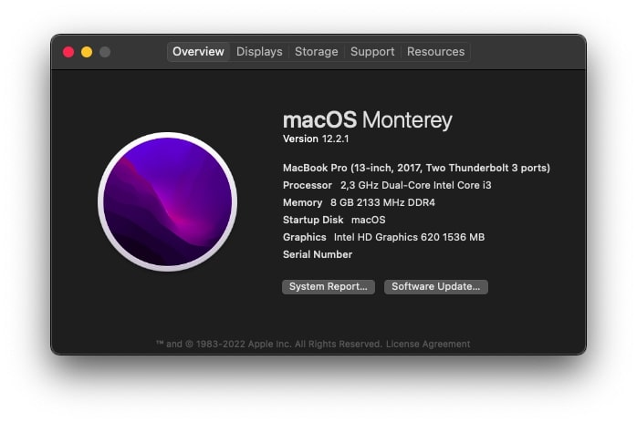

# A315-54K-34P6 OpenCore Hackintosh

:information_source: **Current version is fully macOS Monterey compatible.**
OpenCore, drivers, and kexts are always up to date!

:warning: **WARNING:**
This is not a guide, please refer to [Dortania](https://dortania.github.io/getting-started/) before doing anything. This OpenCore configuration is optimized for my specific hardware, so please use it only as a reference or if you happen to have the same or similar hardware.

## Hardware:

| **Category**   | **Component**                 		|	**Note**			 				      |
|----------------|--------------------------------------|---------------------------------------------|
|**CPU**		 |2.3GHz Intel Core i3-7020U	 		|										      |
|**iGPU**		 |Intel HD Graphics 620				    |										      |
|**RAM**         |8GB (4GB non-removable) 2133MHz DDR4  |										      |
|**SSD**         |256GB M.2 PCIe NVMe SSD		 		|										      |
|**Display**     |15,6" 1080p LCD non-touch display		|										      |
|**Wi-Fi/BT**    |Intel Dual Band Wireless-AC 3160	  	|Replaced original Qualcomm QCA9377.	      |
|**Ethernet**    |Realtek RTL8111				 		|										      |
|**Audio** 		 |Realtek ALC255				 		|86 for the layout ID seems to work the best. |
|**Input**       |PS2 Keyboard & I2C Synaptics TrackPad |										      |

## Working/not working:

- [x] CPU power management.
- [x] Graphics acceleration.
- [x] Battery read-out.
- [x] Keyboard & trackpad with all macOS gestures.
- [x] Wi-Fi.
- [x] Bluetooth.
- [x] USB ports.
- [x] HDMI video & audio output.
- [x] Ethernet.
- [x] Audio (Internal speakers, 3.5mm headphone jack).
- [x] Internal microphone.
- [x] VGA WebCam.
- [x] AirDrop & Handoff.
- [x] iCloud & App Store.
- [x] iMessage & FaceTime.

I managed to get the Wi-Fi working by replacing my original `Qualcomm QCA9377` with `Intel AC 3160` and with now various Intel wireless cards being supported in macOS (thanks to the [OpenIntelWireless](https://github.com/OpenIntelWireless)), I've been able to get mine up and running as well. If your Intel wireless card is not in the [supported list](https://openintelwireless.github.io/itlwm/Compat.html#dvm-iwn) or if you have a different wireless card, you should remove `AirportItlwm.kext` from the Kexts folder.

As for the Bluetooth, it was a bit more complicated. It's been months since I successfully booted into macOS with this configuration, and it wasn't till recently that I worked out a solution for Bluetooth. I thought it was faulty hardware as I never got the Bluetooth to work in both macOS and Linux, but to my surprise, it was something quite not expected.

AC 3160 Bluetooth solution

 
Apparently, it seems like my Intel wireless card has some incompatible pins, or may I say a different arrangement from the original one (`QCA9377`). Long story short, I had to tape two pins on my `AC 3160` that are used to sense a Wi-Fi/Bluetooth "power off" signal. Blocking the two pins prevents the card from receiving a "power off" signal and keeps it on continuously.

Since the old card (`QCA9377`) lacked these pins, taping the two in the new one seems to be a solution. If you are facing a similar issue or want to find out more, check out this amazing [**article**](https://thecomputerperson.wordpress.com/2016/11/04/how-to-mask-off-the-wifi-power-off-pins-on-m-2-ngff-wireless-cards-the-old-mini-pci-pin-20-trick/) that cleared it out to me.

If your Intel Bluetooth device is not in the [supported list](https://openintelwireless.github.io/IntelBluetoothFirmware/Compat.html) or if you have a different Bluetooth device, you should remove `IntelBluetoothFirmware.kext` from the Kexts folder.

I went with an Intel wireless card for the Wi-Fi & Bluetooth as it was a cheaper solution (I got it for like 5 bucks used), and to be honest, I have no complaints whatsoever. The Wi-Fi & Bluetooth are working perfectly, I would say even better than what I had with `QCA9377` in Linux. For now, I'm just happy that I have 1 more USB port and that I don't have to use a USB Wi-Fi card anymore.

If you want a working Wi-Fi & Bluetooth out of the box, I suggest you look for Apple-branded Broadcom wireless counterparts.
 
## Credits:

[**Acer**](http://acer.com/) for the laptop.

[**Apple**](http://apple.com/) for the macOS.

[**RehabMan**](https://github.com/RehabMan) for the great guides.

[**alexandred**](https://github.com/alexandred) for VoodooI2C kext and making it work with the trackpad.

[**Acidanthera**](https://github.com/acidanthera) for awesome kexts and first-class support for hackintosh enthusiasts.

[**OpenIntelWireless**](https://github.com/OpenIntelWireless) for Intel WI-FI & Bluetooth drivers.